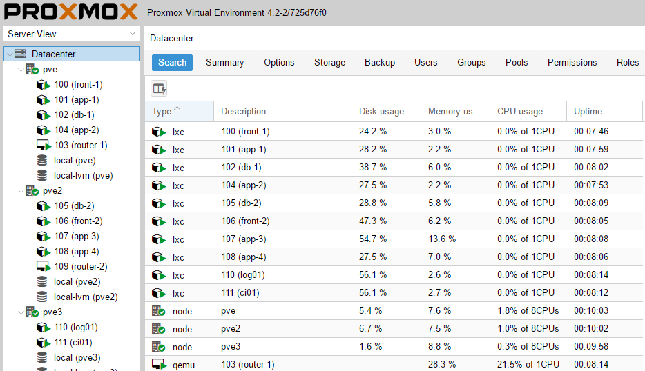

# Proxmox Virtual Environment
##### Puppet scripts for my home lab high-availability(HA) development environment.
A lab environment for software development and infrastructure
that has a production like configuration that I use to learn and
practice on DevOps, automating the environment as much as I manage.

##### Features
* clustered proxmox virtual environment on three machines.
* hardware failover with virtualized linux containers deployed on three machines.
* firewall with failover.
* secured network, divided into separate vlan zones.
* database with failover.
* load balanced frontend servers.
* load balanced node backend server.
* immutable virtual servers.
* a sample web application.

##### Hardware
Three retired work laptops, Lenovo W520 and W530 with 16GB ram
 and old school spinning hard drives connected with a Cisco
 switch with VLAN support, SG 200-08, for directing network
 traffic between them.

##### Proxmox cluster on three nodes.

##### Virtual machines overview

##### The sample application that is deployed
Is a very simple React application [Blogr](https://github.com/dniel/blogr-workshop)
that uses a Node Express backend and a PostgreSQL database for
persistence. Right now its deployed using the same puppet script
that install the configuration and system software but this
eventually be handled by Jenkins Pipeline.

## Description
This module configure the linux servers in my virtual development environment.
It configures a pretty standard HA environment with double frontend servers with reverseproxies that
load balance infront of four backend servers that has been divided in two clusters and using a primary and 
hot-standby for stored state. Everything is devided in a DMZ and INTRA network for production like network
configuration.

## Installation
#### First steps
##### Create VLANs in the network switch
Name the vlans
* 2=DMZ
* 3=INTRA
* 4=SYNC
* 5=DEV

DMZ is the internet facing vlan.
INTRA is the internal corporate network.
SYNC is the network pfSense instances uses to sync failover state.
DEV is the development infrastructure network, where Jenkins and ELK is configured.

The network setup use subnets 10.0.1.x, 10.0.2.x, 10.0.3 and 10.0.4.x

##### Download and install proxmox
Install Proxmox on all three laptops.
* Proxmox version > 4.2
* Create four virtual ethernet devices in proxmox.
* Tag the virtual ethernet devices with vlan tag 2,3,4 and 5

##### Download, install and configure pfSense
* pfSense version > 2.3.1-RELEASE-p5
* Create a linux VM in Proxmox, install pfsense.
* Assign all virtual ethernet devices from proxmox to the qemu linux container.
* Create four interfaces in pfsense, DMZ and INTRA on two new subnets.

##### To create a new LXC container
* Create a Debian 8 LXC container.
* Name the container app-, front- or db- dependening of the role you want for the new container.
* Assign correct virtual network device depending on which vlan you want your container.
* Assign vlan tag to network device (dmz=2, intra=3, dev=4)
* Configure Hiera-data in this module for the new container

#### Then
##### perform manual steps that must be performed on each virtual container.
* Install GIT for cloning this repo,
* Install ca-certificates for https/ssl when cloning from https.
* Cloned this repo with puppet scripts as /opt/pve

## Limitations
* Tested with Proxmox Virtual Environment 4.2-2/725d76f0.
* Virtual containers in Proxmox LXC installed with Debian 8.
* pfSense for firewall, gateway, routing, virtual ips of WAN, DMZ and LAN.
* A hardware network switch to route the vlans between different hardware nodes.
* Will not configure proxmox or pfsense, both must be manually installed and configured.

### Future development
* ELK stack for tracking nginx, postgres, puppet, proxmox pfsense and other important logfiles from all parts of the system.
* NAS, Network storage using iSCSI drive with multiple bays for configuring RAID failover on hard drives.
* Configure proxmox with puppet
* Configure pfSense with puppet
* Jenkins2 build server with Pipeline for deploying the Node Application to dev, test and production.
* Secured and hardened jump/login server to give access all virtal servers from remote login.