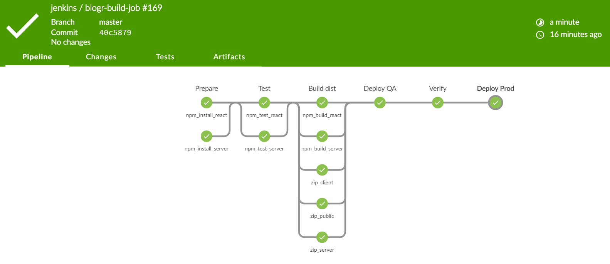

# Continuous integration
### continuous integration and deployment.
Three main components in the architecture enable us to perform continuous delivery, deployment and integration.
The Jenkins build server, Git version control system and automated tests of application.

### The deploy pipeline for the sample application
Jenkins is used both as a job scheduler to provide a central place to monitor if scheduled processes run as planned and to build and test the software. 
The blogr-build-job provide an scheduled deployment pipeline to all environments and run automated tests in the build to avoid broken releases. It run as often as scheduled in the build description, but does not execute any steps if no changes is detected.
It has no manual input steps, if all tests is green the application is released to production after it has been validated with unit tests and end-to-end integration tests on the staging servers.

### Puppet apply
The blogr-pve-job is a scheduled job that run puppet apply on all servers. 
It will update all servers every two hours, regardless if the puppet scripts has any changes or not.

The UI in the screenshots are from the really nice looking [Blue Ocean](https://jenkins.io/projects/blueocean/) 
