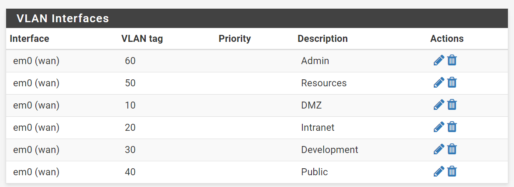

# PfSense setup
### Download, install and configure pfSense
* pfSense version > 2.3.1-RELEASE-p5
* Create a linux VM called router-1 in Proxmox node 1, install pfsense
* Restore backup [configuration for router-1 in pfsense](../files/router-1/config.xml)

### OpenVPN
Provide private access to the network from remote.

### DNS-Forwarding (dnsmasq)
To be able to use DHCP and custom hostnames on the internal network 
I use my own internal DNS server in pfSense. Also dnsmasq is configured
to forward queries of the _consul_ domain to the consul server port 8500
so that we can use the DNS feature of consul to lookup services on the
network.

### DHCP
With vlans and different subnets, I have enabled DHCP on all subnets
to avoid needing to specify ip-adresses on each container.

### VLAN configuration
The different vlans has been created in pfSense.
